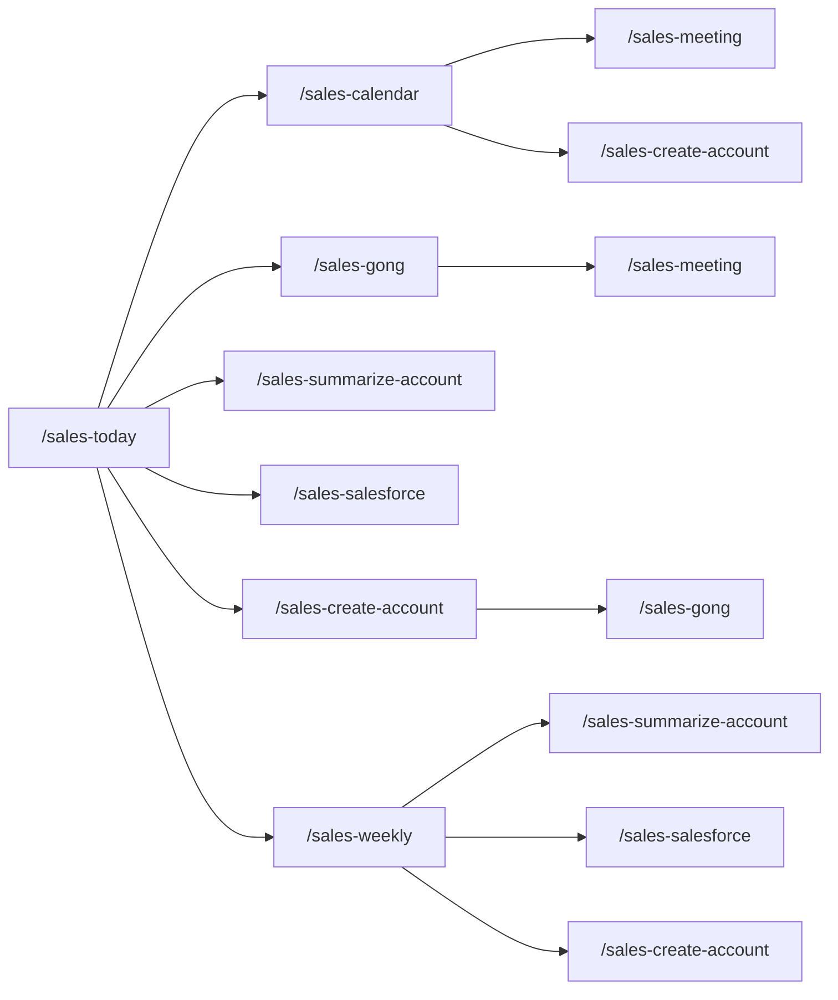

# Claude Code Skills for Sales and RevOps Teams

Claude Code skills for managing sales accounts, meeting notes, and deal documentation in [Obsidian](https://obsidian.md). Automates the RevOps workflow: calendar scanning, Gong transcript imports, MEDDPICC tracking, and Salesforce updates.

## Table of Contents

- [Skills](#skills)
  - [`/sales-today`](#ld-today)
  - [`/sales-calendar`](#ld-calendar)
  - [`/sales-create-account`](#ld-create-account)
  - [`/sales-git`](#ld-git)
  - [`/sales-gong`](#ld-gong)
  - [`/sales-meeting`](#ld-meeting)
  - [`/sales-review-learnings`](#ld-review-learnings)
  - [`/sales-salesforce`](#ld-salesforce)
  - [`/sales-setup`](#sales-setup)
  - [`/sales-summarize-account`](#ld-summarize-account)
  - [`/sales-weekly`](#ld-weekly)
- [Skill Dependency Graph](#skill-dependency-graph)
- [Prerequisites](#prerequisites)
- [Obsidian Vault Setup](#obsidian-vault-setup)
- [Getting Started](#getting-started)
  - [1. Install the skills](#1-install-the-skills)
  - [2. Run `/sales-setup`](#2-run-sales-setup)
- [Workflow](#workflow)
  - [Scheduled task setup](#scheduled-task-setup)
  - [New account onboarding](#new-account-onboarding)
  - [Ongoing usage](#ongoing-usage)
  - [Asking questions about a deal](#asking-questions-about-a-deal)
  - [Fixing formatting](#fixing-formatting)
- [Customizing and creating skills](#customizing-and-creating-skills)
  - [Updating existing skills](#updating-existing-skills)
  - [Creating new skills](#creating-new-skills)
  - [Ideas for improvements](#ideas-for-improvements)
- [Contributing](#contributing)

## Skills

| Skill | Description |
|-------|-------------|
| `/sales-today` | Daily sales workflow: morning prep or evening wrap-up with calendar scan, Gong imports, account summaries, and Salesforce updates |
| `/sales-calendar` | Scan Google Calendar for upcoming meetings, match them to accounts, and auto-create meeting notes via /sales-meeting |
| `/sales-create-account` | Create a new account folder structure with template files and business context |
| `/sales-git` | Commit and push skill changes and auto-regenerate the README |
| `/sales-gong` | Import Gong calls or Granola meetings into Obsidian meeting notes, or bulk import all calls for an account |
| `/sales-meeting` | Create meeting notes for a sales account and link them in the daily note |
| `/sales-review-learnings` | Review patterns and insights discovered by skills: competitors, objections, feature requests, model performance, and template drift |
| `/sales-salesforce` | Push SE Status to Salesforce, scan accounts for opportunities and deal context, or discover all your open opportunities across Salesforce |
| `/sales-setup` | Post-clone setup: configure vault path, name, role, company, symlinks, and optional Salesforce CLI / Playwright MCP / Google Calendar |
| `/sales-summarize-account` | Summarize all meeting notes, update MEDDPICC/TECHMAPS/CoM, enrich contacts, refresh business context |
| `/sales-weekly` | Weekly review of all accounts with open Salesforce opportunities. Pulls deal context, summarizes activity, updates ledgers and Salesforce |

### `/sales-today`

**Usage:** `/sales-today [morning | evening]`

Orchestrates the full daily sales workflow based on time of day. **Morning mode** (before noon) scans today's calendar, creates meeting notes, and processes any outstanding items from previous days (Gong imports, account summaries, Salesforce updates). **Evening mode** (noon or later) processes today's meetings end-to-end, then scans tomorrow's calendar. Automatically creates accounts for unrecognized external meetings and prompts the user to paste Salesforce and Gong URLs. On Friday evenings through Monday mornings, also runs the weekly portfolio review. Designed to run as a [scheduled task](#scheduled-task-setup).

### `/sales-calendar`

**Usage:** `/sales-calendar [week | next week | YYYY-MM-DD]`

Scans Google Calendar for upcoming meetings, identifies which ones map to existing accounts, and automatically creates meeting notes and daily note entries. Classifies events as deal meetings, deal prep, internal meetings, or unrecognized external meetings, and suggests account creation for unrecognized companies. With no arguments, defaults to today (if morning) or tomorrow (if afternoon). Also supports a specific date or an entire week. Uses the Claude.ai built-in Google Calendar integration. Configure via `/sales-setup calendar`.

### `/sales-create-account`

**Usage:** `/sales-create-account <account name> [gong_url]`

Creates a new account folder with the full directory structure (meetings, contacts, templates) and populates the business context section by searching the web for company info and recent news. Optionally accepts a Gong activity URL or Salesforce opportunity URL to link during creation. Triggers automatic Gong historical import if Playwright MCP is configured.

### `/sales-git`

**Usage:** `/sales-git`

Commits and pushes changes to the skills GitHub repo. Pulls latest upstream updates first, scans all SKILL.md files for proprietary information (customer names, staff names, contact names, hardcoded paths, Salesforce credentials) and auto-fixes any leaks before committing. Regenerates the README.md from skill frontmatter. Syncs changes to the public repo with `ld-` to `sales-` renaming.

### `/sales-gong`

**Usage:** `/sales-gong <account name> [gong_or_granola_url]`

Imports call recordings into Obsidian meeting notes using Playwright MCP. Supports four modes: single Gong call import, Granola summary import, scan mode (matches existing meetings to unimported Gong recordings), and bulk import of all historical calls from a Gong activity page. Extracts attendees, briefs, and transcripts.

### `/sales-meeting`

**Usage:** `/sales-meeting <account> [topic] [date]`

Creates a meeting note file for a sales account and links it in today's daily note with a standard checklist (Gong transcript, summarize account, push to Salesforce, send stakeholder update). Supports creating multiple meetings at once with freeform date/topic input. Defaults topic to "Call" if not specified.

### `/sales-review-learnings`

**Usage:** `/sales-review-learnings`

Reviews and acts on patterns discovered by `/sales-summarize-account` and `/sales-weekly`. Shows pending discoveries grouped by category (competitors, objections, feature requests, technical patterns, portfolio insights) and lets you keep, act on, or dismiss each item. Also surfaces model performance alerts and template drift (sections users frequently edit post-generation, suggesting the prompt should be updated).

### `/sales-salesforce`

**Usage:** `/sales-salesforce <account>` or `scan <account>` or `scan open <account>` or `my accounts`

Four modes: **Push** pushes the Salesforce Updates section to linked Opportunities via REST API. **Scan** imports all opportunities with historical deal context. **Scan open** pulls current deal context from open opportunities. **My accounts** discovers all open opportunities where you are the SE, cross-references with Obsidian, and onboards missing accounts.

### `/sales-setup`

**Usage:** `/sales-setup [salesforce | playwright | calendar]`

Guided onboarding that walks through configuration: role, company, name, vault path, and company folder. Searches the web for your company's products and lets you review them. Creates a persistent config file at `~/.claude/skills/sales-config.md` that all other skills read at runtime. Optionally configures the Salesforce CLI (with custom field discovery), Playwright MCP, and Google Calendar (via the Claude.ai built-in integration in Claude Desktop). Re-run anytime to pull upstream updates.

### `/sales-summarize-account`

**Usage:** `/sales-summarize-account <account name>`

Processes all unsummarized meeting notes via parallel subagents, then aggregates findings into the main account file: deal ledger, MEDDPICC, Command of the Message, TECHMAPS, tech stack, architecture diagram, and Salesforce-ready updates. Enriches contacts with LinkedIn profiles. Includes self-improvement features: adaptive model selection based on past performance, pattern discovery (competitors, objections, feature requests), and template drift detection.

### `/sales-weekly`

**Usage:** `/sales-weekly`

Portfolio-wide sweep of all accounts with open Salesforce opportunities. Pulls current deal context, auto-summarizes meetings that have transcripts but no summary, adds status ledger entries, and pushes updates to Salesforce. Includes a weekly retro phase that analyzes run quality, surfaces cross-account patterns (common competitors, objections, tech stacks), and queues discoveries for daily review. Designed to run autonomously at the end of the week.

## Skill Dependency Graph

Shows which skills call other skills. `/sales-today` is the top-level orchestrator: run it daily and it handles everything else.



## Prerequisites

- [Claude Code](https://docs.anthropic.com/en/docs/claude-code) (CLI)
- [Obsidian](https://obsidian.md) with the [Dataview](https://github.com/blacksmithgu/obsidian-dataview) plugin enabled
  - In Dataview settings, enable **Enable Inline Queries** (required for inline expressions like `` `= this.ae` `` to render in account files)
- *Optional, for `/sales-salesforce`:* [Homebrew](https://brew.sh) and [Salesforce CLI](https://developer.salesforce.com/tools/salesforcecli) (`brew install sf`)
- *Optional, for `/sales-gong`:* [Homebrew](https://brew.sh) and [Playwright MCP](https://github.com/anthropics/claude-code/blob/main/docs/mcp.md) (`claude mcp add playwright -- npx @playwright/mcp@latest --browser chromium`)
- *Optional, for `/sales-calendar`:* Claude.ai Google Calendar integration (connect your Google account in Claude Desktop Settings > Integrations, then run `/sales-setup calendar`)

## Obsidian Vault Setup

These skills expect the following top-level folder structure in your Obsidian vault:

```
Vault/
├── Daily/                          # Daily notes (YYYY-MM-DD.md)
└── {Company}/
    └── Accounts/                   # Account folders (created by /sales-create-account)
```

`/sales-setup` will create these folders for you during initial setup. After that, `/sales-create-account` creates the full per-account folder structure automatically:

> **Example after creating an account:**
> ```
> Vault/
> ├── Daily/
> └── {Company}/
>     └── Accounts/
>         └── Acme Corp/
>             ├── Acme Corp.md          # Main account file (MEDDPICC, CoM, TECHMAPS, etc.)
>             ├── Ledger.md             # Deal ledger with chronological entries
>             ├── meetings.base         # Dataview table config for meetings
>             ├── contacts.base         # Dataview table config for contacts
>             ├── meetings/             # Meeting notes (YYYY-MM-DD Topic.md)
>             └── contacts/             # Contact cards ({Person Name}.md)
> ```

You can add additional folders under `{Company}/` as you see fit (for example, `Resources/` for shared collateral, competitive intel, or internal templates). The skills only read from `Accounts/` and `Daily/`.

## Getting Started

### 1. Install the skills

1. Fork this repo on GitHub
2. Clone your fork:
   ```bash
   git clone https://github.com/<your-username>/claude-code-sales-skills.git ~/repos/claude-code-sales-skills
   ```
3. Add upstream so you can pull future updates from the original repo:
   ```bash
   cd ~/repos/claude-code-sales-skills
   git remote add upstream https://github.com/<original-author>/claude-code-sales-skills.git
   ```

To pull upstream updates later, just run `/sales-setup` (it checks for updates automatically).

### 2. Run `/sales-setup`

Run `/sales-setup` in Claude Code. It will:
- Ask for your role, company, name, and Obsidian vault path
- Search for your company's products and let you review them
- Create a persistent config file at `~/.claude/skills/sales-config.md`
- Create symlinks in `~/.claude/skills/`
- Set up your vault folder structure
- Optionally configure the Salesforce CLI (with custom field auto-discovery), Google Calendar, and Playwright MCP

## Workflow

### Scheduled task setup

The recommended way to use these skills is to run `/sales-today` as a daily scheduled task. It handles calendar scanning, Gong imports, account summaries, and Salesforce updates automatically.

**Set up in Claude Desktop:**

1. Open Claude Desktop
2. Click the **Code** tab (bottom of the sidebar)
3. Go to **Scheduled Tasks**
4. Click **Add Task** and configure:
   - **Name:** Daily Sales Workflow
   - **Schedule:** Daily at **5:00 PM** (or whenever you typically finish your last call)
   - **Working Directory:** Your home directory (e.g., `/Users/you`)
   - **Prompt:** `/sales-today`
5. Save the task

**Why evening?** Gong typically needs 1-2 hours to process recordings. Running in the evening ensures today's calls are available for import. The evening run also scans tomorrow's calendar so your meeting notes are ready before the next day starts. On Fridays, it automatically triggers the weekly portfolio review.

**What it does each run:**
- Imports Gong transcripts for today's meetings
- Summarizes accounts with new meeting data
- Pushes updates to Salesforce
- Scans tomorrow's calendar and creates meeting notes
- Creates accounts for any new companies (prompts you to add Salesforce/Gong URLs)
- Runs `/sales-weekly` on Friday evenings

You can also run `/sales-today` manually at any time. It detects morning vs. evening mode automatically.

### New account onboarding

1. **Create the account:**
   ```
   /sales-create-account Acme Corp
   ```
   This creates the full folder structure, populates business context from the web, and sets up template files.

2. **Import historical calls from Gong:**
   Search for the account in Gong, go to the Activity tab, and check "Calls Only." Then run `/sales-meeting` with all the call dates and descriptions. The input is freeform. Claude is pretty smart at figuring out what you mean, so just list them however is fastest:
   ```
   /sales-meeting Acme Corp

   1/15 Discovery
   1/22 Platform Demo
   2/3 Technical sync
   2/10
   2/14 Follow-up with VP Eng
   ```
   Comma-separated works too, and you can mix date formats:
   ```
   /sales-meeting Acme Corp
   Jan 15 Discovery, 1/22 Platform Demo, 2/3 Technical sync, Feb 10, 2/14 Follow-up with VP Eng
   ```

3. **Fill in transcripts:**
   Open each Gong recording in a new tab. For each meeting note that was just created, paste the **Briefing** from Gong into the `## External Summary` section and the **Transcript** into the `## Transcript` section.

4. **Summarize the account:**
   ```
   /sales-summarize-account Acme Corp
   ```
   This launches subagents to process each meeting in parallel, then aggregates everything into the main account file: deal ledger, MEDDPICC, Command of the Message, TECHMAPS, tech stack, architecture diagram, and Salesforce-ready updates.

5. **Update Salesforce and share:**
   ```
   /sales-salesforce Acme Corp
   ```
   This pushes the Salesforce Updates section to all linked Opportunities. Export the main account file as a PDF to share with stakeholders (AEs, CSMs). It doubles as an executive summary to bring anyone up to speed.

### Ongoing usage

After each new meeting:

1. **Create the meeting note:**
   ```
   /sales-meeting Acme Corp Technical Deep-Dive
   ```

2. **Take your own notes** during the call in the meeting file.

3. **Add external transcripts** once Gong (or other tools) finish processing. Paste the summary and transcript into the meeting note.

4. **Re-summarize:**
   ```
   /sales-summarize-account Acme Corp
   ```
   This incrementally updates all account sections with the new meeting data, refreshes the Salesforce update, and commits changes.

5. **Push to Salesforce** and share the updated PDF with your deal team:
   ```
   /sales-salesforce Acme Corp
   ```

### Asking questions about a deal

Beyond the skills, you can use Claude Code to interact with your account data conversationally. Just ask whatever's on your mind. Claude has access to all the meeting notes, contacts, and account context in your vault.

**Deal strategy:**
```
What are the biggest risks in the Acme Corp deal right now?
Who haven't we talked to in over a month?
What open tasks do I have across all my accounts?
```

**Meeting prep:**
```
What should I cover in tomorrow's call with Acme Corp?
Summarize what their VP of Engineering cares about based on past meetings.
What technical objections have come up so far?
```

**Research and context:**
```
What's Acme Corp's current tech stack?
Which accounts are evaluating us against a competitor?
How far along is the Globex POV?
```

### Fixing formatting

If something in an account file doesn't look quite right in Obsidian, just tell Claude what's off and it'll fix it:

```
The MEDDPICC summary callout in Acme Corp is collapsed, it should be open.
The ledger entries in Globex are out of order, newest should be first.
The contacts table in Initech isn't rendering. Can you check the base file?
Move the architecture diagram above the Salesforce Updates section in Acme Corp.
The ledger is calling her Kathy, but she spells it with a C.
```

## Customizing and creating skills

These skills are a starting point. You should customize them for your own workflow. Skills are just markdown files with instructions and optional frontmatter, and Claude Code is great at editing them for you.

### Updating existing skills

Just tell Claude what you want to change:

```
Update /sales-meeting to add a "## Prep Notes" section to the meeting template.
Update /sales-summarize-account so it also tracks security review status under MEDDPICC > Paper Process.
Change /sales-create-account to set deal_type to "Expansion" by default instead of "Net New".
```

### Creating new skills

To create a new skill, just ask Claude:

```
Create a new skill called /sales-prep that reads the account file and upcoming meeting agenda,
then generates a one-page prep doc with talking points, open questions, and recent news.
```

Claude will create a `SKILL.md` file in a new directory under `~/.claude/skills/` (or in your repo if you tell it to). Skills are just natural language instructions with optional YAML frontmatter. No code required.

### Ideas for improvements

Here are some directions you could take this:

- **Gong API integration:** Use an [MCP server](https://modelcontextprotocol.io/) or API calls to pull transcripts and briefings directly from Gong instead of copy-pasting
- ~~**Google Calendar integration**~~ (done)
- **Competitive intelligence:** Add a skill that searches for competitor mentions across all account meetings and builds a comparison matrix
- **Pipeline dashboard:** Create a skill that reads all account files and generates a summary table with deal stage, next call, and MEDDPICC completeness
- **POV tracking:** Add a skill for managing proof-of-value timelines, success criteria, and milestone tracking
- **Email drafts:** Generate follow-up emails or internal updates from the latest meeting summary and next steps
- **Email and Slack context:** Pull in relevant email threads and Slack messages as additional context for account summaries, using MCP servers for [Gmail](https://github.com/anthropics/claude-code/blob/main/docs/mcp.md) and [Slack](https://github.com/anthropics/claude-code/blob/main/docs/mcp.md)
- **Static site hosting:** Publish account files as static pages (e.g., via [Obsidian Publish](https://obsidian.md/publish), [Quartz](https://quartz.jzhao.xyz/), or GitHub Pages) so stakeholders can view live account summaries in a browser instead of receiving PDF exports

If you build something useful, consider contributing it back. See [Contributing](#contributing) below.

## Contributing

Contributions are welcome! If you've built a new skill, improved an existing one, or fixed a bug, submit a pull request:

1. Make sure your fork is up to date:
   ```bash
   git fetch upstream
   git merge upstream/main
   ```
2. Create a feature branch:
   ```bash
   git checkout -b my-new-skill
   ```
3. Make your changes and commit
4. Push to your fork and open a PR against `main`:
   ```bash
   git push origin my-new-skill
   ```

**Guidelines:**
- Keep skill instructions clear and self-contained. Another user should be able to use your skill without extra context.
- If your skill adds a new `ld-*` directory, `/sales-git` will automatically pick it up for the README.
- Test your skill on at least one real account before submitting.
- Don't include vault-specific paths, company names, or personal info. Use `{config.*}` references and `/sales-setup` handles personalization.
- `/sales-git` will check for proprietary information before committing and auto-fix any leaks.
