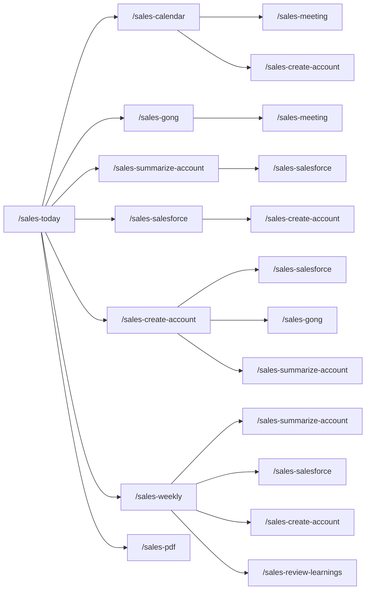

# Claude Code Skills for Sales Teams

Claude Code skills for managing sales accounts, meeting notes, and deal documentation in [Obsidian](https://obsidian.md). Automates the RevOps workflow: calendar scanning, Gong transcript imports, MEDDPICC tracking, Salesforce updates, and SE coaching.

## Table of Contents

- [Skills](#skills)
  - [`/sales-today`](#sales-today)
  - [`/sales-calendar`](#sales-calendar)
  - [`/sales-create-account`](#sales-create-account)
  - [`/sales-git`](#sales-git)
  - [`/sales-gong`](#sales-gong)
  - [`/sales-meeting`](#sales-meeting)
  - [`/sales-pdf`](#sales-pdf)
  - [`/sales-review-learnings`](#sales-review-learnings)
  - [`/sales-salesforce`](#sales-salesforce)
  - [`/sales-setup`](#sales-setup)
  - [`/sales-summarize-account`](#sales-summarize-account)
  - [`/sales-weekly`](#sales-weekly)
  - [`/schedule-usps-pickup`](#schedule-usps-pickup)
- [Skill Dependency Graph](#skill-dependency-graph)
- [Prerequisites](#prerequisites)
- [Obsidian Vault Setup](#obsidian-vault-setup)
- [Getting Started](#getting-started)
  - [1. Install the skills](#1-install-the-skills)
  - [2. Run `/sales-setup`](#2-run-sales-setup)
  - [3. Set up the daily scheduled task](#3-set-up-the-daily-scheduled-task)
- [Workflow](#workflow)
  - [New account onboarding](#new-account-onboarding)
  - [Ongoing usage](#ongoing-usage)
  - [Asking questions about a deal](#asking-questions-about-a-deal)
  - [Fixing formatting](#fixing-formatting)
- [Customizing and creating skills](#customizing-and-creating-skills)
  - [Updating existing skills](#updating-existing-skills)
  - [Creating new skills](#creating-new-skills)
  - [Ideas for improvements](#ideas-for-improvements)
- [Contributing](#contributing)

## Skills

| Skill | Description |
|-------|-------------|
| `/sales-today` | Daily sales workflow: morning prep or evening wrap-up with calendar scan, AE exec summaries, coaching tips, Gong imports, account summaries, Salesforce updates, and PDF exports |
| `/sales-calendar` | Scan Google Calendar for upcoming meetings, match them to accounts, extract agendas, generate targeted questions, and auto-create meeting notes |
| `/sales-create-account` | Create a new account folder structure with template files and business context |
| `/sales-git` | Commit and push skill changes and auto-regenerate the README |
| `/sales-gong` | Import Gong calls or Granola meetings into Obsidian meeting notes, or bulk import all calls for an account |
| `/sales-meeting` | Create meeting notes for a sales account and link them in the daily note |
| `/sales-pdf` | Export account files to PDF with clean formatting via pandoc and Playwright |
| `/sales-review-learnings` | Review patterns and insights discovered by skills: competitors, objections, feature requests, model performance, and template drift |
| `/sales-salesforce` | Push SE Status to Salesforce, scan accounts for opportunities and deal context, or discover all your open opportunities across Salesforce |
| `/sales-setup` | Post-clone setup: configure vault path, name, role, company, symlinks, and optional Salesforce CLI / Playwright CLI / Google Calendar |
| `/sales-summarize-account` | Summarize all meeting notes, update MEDDPICC/TECHMAPS/CoM, enrich contacts, refresh business context |
| `/sales-weekly` | Weekly review of all accounts with open Salesforce opportunities: pulls deal context, scores deal health (Red/Yellow/Green), summarizes activity, updates ledgers and Salesforce |
| `/schedule-usps-pickup` | Schedule a USPS package pickup for the next available day |

### `/sales-today`

**Usage:** `/sales-today [morning | evening] [no gong]`

Orchestrates the daily sales workflow based on time of day. Designed to run as a scheduled task in Claude Desktop.

- **Morning** (before noon): scans today's calendar, creates meeting notes, generates per-AE exec summaries with deal insights, adds a daily coaching tip, processes outstanding items from previous days
- **Evening** (noon or later): processes today's meetings (Gong, summaries, Salesforce), scans tomorrow's calendar, generates exec summaries for tomorrow
- **`no gong` flag**: Skip all Gong import steps (useful for automated/scheduled runs where Gong auth may not be available). Can be combined with morning/evening.
- **AE Exec Summaries**: Groups deal meetings by AE and generates a Slack-ready briefing per AE — attendee-aware with roles and past participation, concise 3-4 bullets per account, Slack-compatible markdown (`*bold*`). Includes a Yesterday's Recap section with outcomes from the prior day's calls.
- **Coaching Tip**: Analyzes the SE's actual speaking turns in recent call transcripts and surfaces one specific, actionable improvement grounded in a real moment from a real call. Maintains a persistent coaching log at `{Company}/Resources/Coaching Log.md` that tracks active focus areas, follows up on recurring patterns, detects improvement, and celebrates wins. Auto-creates the `Resources/` folder and `Coaching Log.md` file if they don't exist.
- Friday evening through Monday morning: also runs `/sales-weekly`
- Auto-creates accounts for unrecognized external meetings, prompts for Salesforce/Gong URLs
- Designed to run as a [scheduled task](#3-set-up-the-daily-scheduled-task)

### `/sales-calendar`

**Usage:** `/sales-calendar [week | next week | YYYY-MM-DD]`

Scans Google Calendar for upcoming meetings, identifies which ones map to existing accounts, and automatically creates meeting notes and daily note entries.

- Extracts agendas from calendar event descriptions (strips video conferencing boilerplate, preserves meaningful content)
- Generates 3-5 targeted questions per meeting based on MEDDPICC/TECHMAPS gaps, meeting type, and deal stage
- Adds competitive intelligence questions based on competitor mentions in the account and cross-account learnings
- Classifies events: deal meetings, deal prep, internal, or unrecognized external
- No arguments: defaults to today (morning) or tomorrow (afternoon)
- Suggests `/sales-create-account` for unrecognized companies
- Uses the Claude.ai built-in Google Calendar integration. Configure via `/sales-setup calendar`

### `/sales-create-account`

**Usage:** `/sales-create-account <account name> [gong_url] [salesforce_url]`

Creates a new account folder structure with template files and populates business context from the web.

- Creates account folder with full directory structure (meetings, contacts, templates)
- Optionally accepts a Gong activity URL, Salesforce Account URL, or Salesforce Opportunity URL (any combination, any order)
- Salesforce Account URL: runs `/sales-salesforce scan` to discover all open and closed opportunities
- Salesforce Opportunity URL: looks up the parent account, then scans all opportunities
- Opens the Gong browser early (Step 0) so you can authenticate while setup runs in the background
- Triggers automatic Gong historical import if Playwright CLI is configured — never skips imports
- After imports complete, runs `/sales-summarize-account` to populate MEDDPICC, deal ledger, and all account sections

### `/sales-git`

**Usage:** `/sales-git`

Commits and pushes any changes to the skills GitHub repo.

- Pulls latest upstream updates, scans SKILL.md files for proprietary information, auto-fixes leaks
- Regenerates README.md from skill frontmatter
- Commits, pushes, and syncs to public repo with `ld-` to `sales-` renaming

### `/sales-gong`

**Usage:** `/sales-gong <account name> [gong_or_granola_url]`

Imports Gong calls or Granola meetings into Obsidian meeting notes using [Playwright CLI](https://github.com/microsoft/playwright-cli) for browser automation.

- Four modes: single Gong call, Granola summary, scan (match existing meetings to unimported recordings), bulk import
- Gong imports are mandatory: never skips a call that has a recording, even if the meeting file already has notes. If auth fails, keeps prompting until resolved
- Extracts attendees, briefs, and transcripts in parallel using browser tabs (up to 3 calls at once)
- Background subagents write to meeting files while the browser continues extracting the next batch

### `/sales-meeting`

**Usage:** `/sales-meeting <account> [topic] [date]`

Creates a meeting note for a sales account and links it in today's daily note.

- Creates a meeting note and links it in today's daily note with a standard checklist
- Checklist: Gong transcript, summarize account, push to Salesforce, send stakeholder update
- Supports creating multiple meetings at once with freeform date/topic input

### `/sales-pdf`

**Usage:** `/sales-pdf [account | all | today]`

Exports account markdown files to professionally formatted PDFs. Preprocesses Obsidian-specific syntax (dataview queries, wiki-links, callouts, transclusion embeds), resolves inline field references from frontmatter, generates contacts and meetings tables, converts to HTML via pandoc, and prints to PDF via Playwright MCP.

- No arguments or `today`: exports accounts that were summarized during the current `/sales-today` run
- Specific account name: exports just that account
- `all`: exports every account with substantive content (skips template-only files)
- PDFs are organized into date subfolders: `{pdf_path}/{YYYY-MM-DD}/{YYYY-MM-DD} {Account}.pdf`
- Requires `pandoc` (`brew install pandoc`) and Playwright MCP (`/sales-setup playwright`)
- Enable via `/sales-setup` (sets `pdf_export: true` and `pdf_path` in config)
- Called automatically by `/sales-today` after account summaries complete

### `/sales-review-learnings`

**Usage:** `/sales-review-learnings`

Reviews and acts on patterns discovered by `/sales-summarize-account` and `/sales-weekly`.

- Groups by category: competitors, objections, feature requests, technical patterns, portfolio insights
- Surfaces model performance alerts and template drift
- Interactive: keep, act (create a task), or dismiss each item

### `/sales-salesforce`

**Usage:** `/sales-salesforce <account>` or `scan <account>` or `scan open <account>` or `my accounts`

Four modes for Salesforce integration:

- **Push** (default): pushes Salesforce Updates section to linked Opportunities via REST API
- **Scan:** imports all opportunities with historical deal context
- **Scan open:** pulls current deal context from open opportunities
- **My accounts:** discovers all open opportunities where you are the SE, onboards missing accounts

### `/sales-setup`

**Usage:** `/sales-setup [salesforce | playwright | calendar]`

Guided onboarding for the Obsidian sales skills. Re-run anytime to pull upstream updates and re-apply your config.

- Guided onboarding: role, company, name, vault path, company folder
- Searches the web for your company's products and lets you review them
- Creates persistent config at `~/.claude/skills/sales-config.md`
- Optionally configures Salesforce CLI (with custom field auto-discovery), Playwright CLI, and Google Calendar
- Re-run anytime to pull upstream updates

### `/sales-summarize-account`

**Usage:** `/sales-summarize-account <account name>`

Summarizes all meeting notes for an account and updates the account page.

- Processes unsummarized meeting notes via parallel subagents
- Updates: deal ledger, MEDDPICC, Command of the Message, TECHMAPS, tech stack, architecture diagram, Salesforce updates
- Enriches contacts with LinkedIn profiles
- Refreshes business context with latest company news
- Adaptive model selection, pattern discovery, and template drift detection

### `/sales-weekly`

**Usage:** `/sales-weekly`

Portfolio-wide sweep of all accounts with open Salesforce opportunities. Designed to run autonomously: start it and walk away.

- **Deal Risk Radar**: Scores each open opportunity as Green/Yellow/Red based on 9 signals (champion engagement, stage velocity, stakeholder breadth, competitive pressure, etc.). Pushes health score to Salesforce if configured (`SE_Opportunity_Health__c` or equivalent)
- Auto-summarizes meetings with transcripts, adds ledger entries, pushes to Salesforce
- Weekly retro: cross-account patterns (competitors, objections, tech stacks), queues discoveries for review
- Auto-fixes bad opportunity URLs and handles newly closed opportunities

### `/schedule-usps-pickup`

**Usage:** `/schedule-usps-pickup <count> [service type], <count> [service type] [date]`

Schedules a USPS package pickup using the USPS website via Playwright CLI browser automation.

- Flexible input: specify counts with optional service types (ground, priority, express, return, international, other) separated by commas
- Defaults to USPS Ground Advantage if no service type given, and next available business day if no date specified
- Supports date formats: M/D, MM/DD, or day-of-week (e.g., "friday", "saturday", "tomorrow")
- Pre-fills address and contact info, selects Mail Room as pickup location, submits automatically without confirmation
- Reports confirmation number, date, and package breakdown when complete

## Skill Dependency Graph

Shows which skills call other skills. `/sales-today` is the top-level orchestrator: run it daily and it handles everything else.



## Prerequisites

- [Claude Code](https://docs.anthropic.com/en/docs/claude-code) (CLI)
- [Obsidian](https://obsidian.md) with the [Dataview](https://github.com/blacksmithgu/obsidian-dataview) plugin enabled
  - In Dataview settings, enable **Enable Inline Queries** (required for inline expressions like `` `= this.ae` `` to render in account files)
- *Optional, for `/sales-salesforce`:* [Homebrew](https://brew.sh) and [Salesforce CLI](https://developer.salesforce.com/tools/salesforcecli) (`brew install sf`)
- *Optional, for `/sales-gong`:* [Playwright CLI](https://github.com/microsoft/playwright-cli) (`npm install -g @playwright/cli@latest`)
- *Optional, for `/sales-pdf`:* [pandoc](https://pandoc.org) (`brew install pandoc`) and Playwright MCP (same as `/sales-gong`)
- *Optional, for `/sales-calendar`:* Claude.ai Google Calendar integration (connect your Google account in Claude Desktop Settings > Integrations, then run `/sales-setup calendar`)

## Obsidian Vault Setup

These skills expect the following top-level folder structure in your Obsidian vault:

```
Vault/
├── Daily/                          # Daily notes (YYYY-MM-DD.md)
└── {Company}/
    ├── Accounts/                   # Account folders (created by /sales-create-account)
    └── Resources/                  # Auto-created by /sales-today for coaching log
```

`/sales-setup` will create `Daily/` and `{Company}/Accounts/` for you during initial setup. The `Resources/` folder is auto-created by `/sales-today` the first time it generates a coaching tip. After that, `/sales-create-account` creates the full per-account folder structure automatically:

> **Example after creating an account:**
> ```
> Vault/
> ├── Daily/
> └── {Company}/
>     ├── Accounts/
>     │   └── Acme Corp/
>     │       ├── Acme Corp.md          # Main account file (MEDDPICC, CoM, TECHMAPS, etc.)
>     │       ├── Ledger.md             # Deal ledger with chronological entries
>     │       ├── meetings.base         # Dataview table config for meetings
>     │       ├── contacts.base         # Dataview table config for contacts
>     │       ├── meetings/             # Meeting notes (YYYY-MM-DD Topic.md)
>     │       └── contacts/             # Contact cards ({Person Name}.md)
>     └── Resources/
>         └── Coaching Log.md           # Persistent coaching tip history and focus areas
> ```

You can add additional folders under `{Company}/` as you see fit (for example, competitive intel or internal templates). The skills primarily read from `Accounts/` and `Daily/`, with `Resources/` used for the coaching log.

## Getting Started

### 1. Install the skills

1. Fork this repo on GitHub
2. Clone your fork:
   ```bash
   git clone https://github.com/<your-username>/claude-code-sales-skills.git ~/repos/claude-code-sales-skills
   ```
3. Add upstream so you can pull future updates from the original repo:
   ```bash
   cd ~/repos/claude-code-sales-skills
   git remote add upstream https://github.com/<original-author>/claude-code-sales-skills.git
   ```

To pull upstream updates later, just run `/sales-setup` — it checks for updates automatically.

> **Updating from an older version?** If your `/sales-setup` doesn't pull updates automatically, run this once to get current:
> ```bash
> cd ~/repos/claude-code-sales-skills
> git fetch upstream
> git merge upstream/main --no-edit
> ```
> Then run `/sales-setup` to re-apply your config. Future updates will be handled automatically.

### 2. Run `/sales-setup`

Run `/sales-setup` in Claude Code. It will:
- Ask for your role, company, name, and Obsidian vault path
- Search for your company's products and let you review them
- Create a persistent config file at `~/.claude/skills/sales-config.md`
- Create symlinks in `~/.claude/skills/`
- Set up your vault folder structure
- Optionally configure integrations (you can also set these up later):
  - Salesforce CLI (with custom field auto-discovery): `/sales-setup salesforce`
  - Google Calendar (via Claude.ai integration): `/sales-setup calendar`
  - Playwright CLI (for Gong imports): `/sales-setup playwright`

### 3. Set up the daily scheduled task

The recommended way to use these skills is to run `/sales-today` as a daily scheduled task. It handles calendar scanning, Gong imports, account summaries, and Salesforce updates automatically.

**Set up in Claude Desktop:**

1. Open Claude Desktop
2. Click the **Code** tab (bottom of the sidebar)
3. Go to **Scheduled Tasks**
4. Click **Add Task** and configure:
   - **Prompt:** `/sales-today`
   - **Working Directory:** Your home directory (e.g., `/Users/you`)
   - **Frequency:** Daily at **5:00 PM** (or whenever you typically finish your last call)
   - **Ask permissions:** Bypass permissions
5. Save the task

**Why evening?** Gong typically needs 1-2 hours to process recordings. Running in the evening ensures today's calls are available for import. The evening run also scans tomorrow's calendar so your meeting notes are ready before the next day starts. On Fridays, it automatically triggers the weekly portfolio review.

**What it does each run:**
- Imports Gong transcripts for today's meetings
- Summarizes accounts with new meeting data
- Pushes updates to Salesforce
- Scans tomorrow's calendar and creates meeting notes (with agendas, targeted questions, and competitive intel)
- Generates per-AE exec summaries with deal insights for tomorrow's meetings
- Adds a daily coaching tip based on recent call patterns (tracked in `Resources/Coaching Log.md`)
- Exports updated account PDFs if PDF export is enabled (via `/sales-pdf`)
- Creates accounts for any new companies (prompts you to add Salesforce/Gong URLs)
- Runs `/sales-weekly` on Friday evenings (includes Deal Risk Radar with Red/Yellow/Green scoring)

You can also run `/sales-today` manually at any time. It detects morning vs. evening mode automatically.

## Workflow

### New account onboarding

1. **Create the account:**
   ```
   /sales-create-account Acme Corp
   ```
   This creates the full folder structure, populates business context from the web, and sets up template files.

   If you provide the Gong activity URL and/or Salesforce URL, it will automatically:
   - Import all historical Gong calls (briefs + transcripts) via Playwright CLI
   - Scan Salesforce for all opportunities and deal history
   - Summarize the account (MEDDPICC, CoM, TECHMAPS, deal ledger, tech stack)

   The full onboarding runs end-to-end with a single command.

2. **Update Salesforce and share:**
   ```
   /sales-salesforce Acme Corp
   ```
   This pushes the Salesforce Updates section to all linked Opportunities. Export the main account file as a PDF to share with stakeholders (AEs, CSMs). It doubles as an executive summary to bring anyone up to speed.

### Ongoing usage

After each new meeting:

1. **Create the meeting note:**
   ```
   /sales-meeting Acme Corp Technical Deep-Dive
   ```

2. **Take your own notes** during the call in the meeting file.

3. **Add external transcripts** once Gong (or other tools) finish processing. Paste the summary and transcript into the meeting note.

4. **Re-summarize:**
   ```
   /sales-summarize-account Acme Corp
   ```
   This incrementally updates all account sections with the new meeting data, refreshes the Salesforce update, and commits changes.

5. **Push to Salesforce** and share the updated PDF with your deal team:
   ```
   /sales-salesforce Acme Corp
   ```

### Asking questions about a deal

Beyond the skills, you can use Claude Code to interact with your account data conversationally. Just ask whatever's on your mind. Claude has access to all the meeting notes, contacts, and account context in your vault.

**Deal strategy:**
```
What are the biggest risks in the Acme Corp deal right now?
Who haven't we talked to in over a month?
What open tasks do I have across all my accounts?
```

**Meeting prep:**
```
What should I cover in tomorrow's call with Acme Corp?
Summarize what their VP of Engineering cares about based on past meetings.
What technical objections have come up so far?
```

**Research and context:**
```
What's Acme Corp's current tech stack?
Which accounts are evaluating us against a competitor?
How far along is the Globex POV?
```

### Fixing formatting

If something in an account file doesn't look quite right in Obsidian, just tell Claude what's off and it'll fix it:

```
The MEDDPICC summary callout in Acme Corp is collapsed, it should be open.
The ledger entries in Globex are out of order, newest should be first.
The contacts table in Initech isn't rendering. Can you check the base file?
Move the architecture diagram above the Salesforce Updates section in Acme Corp.
The ledger is calling her Kathy, but she spells it with a C.
```

## Customizing and creating skills

These skills are a starting point. You should customize them for your own workflow. Skills are just markdown files with instructions and optional frontmatter, and Claude Code is great at editing them for you.

### Updating existing skills

Just tell Claude what you want to change:

```
Update /sales-meeting to add a "## Prep Notes" section to the meeting template.
Update /sales-summarize-account so it also tracks security review status under MEDDPICC > Paper Process.
Change /sales-create-account to set deal_type to "Expansion" by default instead of "Net New".
```

### Creating new skills

To create a new skill, just ask Claude:

```
Create a new skill called /sales-prep that reads the account file and upcoming meeting agenda,
then generates a one-page prep doc with talking points, open questions, and recent news.
```

Claude will create a `SKILL.md` file in a new directory under `~/.claude/skills/` (or in your repo if you tell it to). Skills are just natural language instructions with optional YAML frontmatter. No code required.

### Ideas for improvements

Here are some directions you could take this:

- **Gong API integration:** `/sales-gong` currently uses Playwright CLI for browser automation. A native Gong API or MCP server integration would be faster and more reliable
- ~~**Google Calendar integration**~~ (done)
- ~~**Competitive intelligence**~~ (done — `/sales-calendar` now generates competitive probing questions from cross-account learnings)
- ~~**Deal health scoring**~~ (done — `/sales-weekly` scores deals Red/Yellow/Green and pushes to Salesforce)
- **Pipeline dashboard:** Create a skill that reads all account files and generates a summary table with deal stage, next call, and MEDDPICC completeness
- **Stakeholder map gaps:** Analyze contacts and MEDDPICC to identify missing personas (e.g., no Economic Buyer contact, single-threaded deals)
- **Win/loss pattern matching:** Compare new account profiles against past accounts to surface winning strategies and common failure modes
- **POV tracking:** Add a skill for managing proof-of-value timelines, success criteria, and milestone tracking
- **Email drafts:** Generate follow-up emails or internal updates from the latest meeting summary and next steps
- **Email and Slack context:** Pull in relevant email threads and Slack messages as additional context for account summaries, using MCP servers for [Gmail](https://github.com/anthropics/claude-code/blob/main/docs/mcp.md) and [Slack](https://github.com/anthropics/claude-code/blob/main/docs/mcp.md)
- **Static site hosting:** Publish account files as static pages (e.g., via [Obsidian Publish](https://obsidian.md/publish), [Quartz](https://quartz.jzhao.xyz/), or GitHub Pages) so stakeholders can view live account summaries in a browser instead of receiving PDF exports

If you build something useful, consider contributing it back. See [Contributing](#contributing) below.

## Contributing

Contributions are welcome! If you've built a new skill, improved an existing one, or fixed a bug, submit a pull request:

1. Make sure your fork is up to date:
   ```bash
   git fetch upstream
   git merge upstream/main
   ```
2. Create a feature branch:
   ```bash
   git checkout -b my-new-skill
   ```
3. Make your changes and commit
4. Push to your fork and open a PR against `main`:
   ```bash
   git push origin my-new-skill
   ```

**Guidelines:**
- Keep skill instructions clear and self-contained. Another user should be able to use your skill without extra context.
- If your skill adds a new `sales-*` directory, `/sales-git` will automatically pick it up for the README.
- Test your skill on at least one real account before submitting.
- Don't include vault-specific paths, company names, or personal info. Use `{config.*}` references and `/sales-setup` handles personalization.
- `/sales-git` will check for proprietary information before committing and auto-fix any leaks.
