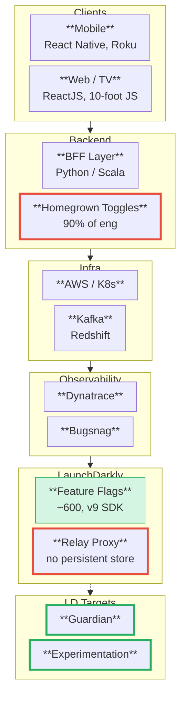

# Architecture Diagram

Generate or update a Mermaid architecture diagram for an account, focused on the actual tools, services, and interfaces between them.

## Arguments

- `account`: The account name (e.g., "Acme Corp")

## Instructions

### Pre-check: Read Config

Read `~/.claude/skills/sales-config.md` and extract: `vault_path`, `company_folder`, `company`, `products`

### Step 1: Gather Architecture Data

Read the account file at `{config.vault_path}/{config.company_folder}/Accounts/{Account}/{Account}.md` and extract:

1. **Tech Stack section** — languages, frameworks, cloud, infra, data, observability, CI/CD, feature flags
2. **TECHMAPS section** — environment, technical requirements, competitors
3. **Architecture Diagram section** — existing diagram content (ASCII or Mermaid)
4. **Meeting notes** — scan `meetings/` for ENVIRONMENT, TECH_STACK, and ARCHITECTURE_NOTES data in transcripts and summaries. Focus on concrete tools and services mentioned, not abstract concepts.

### Step 2: Build the Mermaid Diagram

Always use `graph TD` (top-down) for a vertical layout. This provides the most readable flow from client applications at the top through services, infrastructure, and data layers to observability and tooling at the bottom. Never use `graph LR`.

#### Width Control — CRITICAL

Diagrams MUST be narrow enough to view without horizontal scrolling in Obsidian. Follow these rules:

1. **Max 2 nodes per subgraph.** Group related items into a single node (e.g., "React Native, Roku" in one node labeled "**Mobile**"). This keeps subgraphs narrow.

2. **Single vertical chain of subgraphs.** Connect subgraphs in a single chain: `clients --> backend --> infra --> obs --> ld --> targets`. NEVER create branching edges from one subgraph to two others (e.g., `backend --> infra` AND `backend --> obs`) — this causes Mermaid to place them side-by-side, making the diagram wide.

3. **Node labels with bold title + subtext.** Use `**Title**` on the first line and descriptive subtext on the second line (using a newline inside the label). This gives context without making nodes wider:
   ```
   ff["**Feature Flags**
   ~600, v9 SDK"]
   ```

4. **Short subgraph labels.** Use 1-2 word titles (e.g., "Infra" not "Infrastructure", "Obs" not "Observability & Monitoring").

5. **Compact init config.** Always include:
   ```
   %%{init: {"flowchart": {"nodeSpacing": 8, "rankSpacing": 18, "padding": 10}} }%%
   ```

6. **Do NOT wrap in HTML divs.** Obsidian cannot render mermaid code fences inside HTML blocks. The diagram must be a bare ` ```mermaid ` code fence with no wrapper.

#### Node Categories

Organize nodes into subgraphs by layer. Use only the layers that have known components:

```
subgraph clients["Client Applications"]
```
- Web apps, mobile apps, SPAs, browser extensions
- Include framework (React, Angular, etc.) if known

```
subgraph services["Backend Services"]
```
- APIs, microservices, monoliths, serverless functions
- Include language/framework (Node.js, Python, Ruby, Go, etc.)

```
subgraph infra["Infrastructure"]
```
- Cloud provider services (AWS EKS, GCP GKE, Azure AKS, etc.)
- Container orchestration, serverless platforms
- CDN, load balancers, API gateways

```
subgraph data["Data & Storage"]
```
- Databases (Postgres, MySQL, DynamoDB, etc.)
- Data warehouses (Snowflake, BigQuery, Redshift)
- Message queues (Kafka, RabbitMQ, SQS)
- Cache (Redis, Memcached)

```
subgraph observability["Observability & Monitoring"]
```
- APM (Datadog, New Relic, Dynatrace)
- Logging (Splunk, ELK, CloudWatch)
- Error tracking (Sentry, Bugsnag)
- Session replay tools

```
subgraph devtools["Developer Tooling"]
```
- CI/CD (Jenkins, GitHub Actions, CircleCI)
- Source control (GitHub, GitLab, Bitbucket)
- Feature flags (current provider if not {config.company})
- Identity (Okta, Auth0)

```
subgraph ld["{config.company}"]
```
- {config.company} products in use or being evaluated
- Show SDK integration points

#### Styling

Use Mermaid styling to highlight key information:

```mermaid
%% Pain points: red border
style node_id stroke:#e74c3c,stroke-width:3px

%% LaunchDarkly targets: green border
style node_id stroke:#27ae60,stroke-width:3px

%% Existing LD integration: green fill
style node_id fill:#d5f5e3,stroke:#27ae60
```

- **Red border** (`stroke:#e74c3c`): Pain points, problems, bottlenecks
- **Green border** (`stroke:#27ae60`): Target integration points for {config.company}
- **Green fill** (`fill:#d5f5e3`): Already using {config.company}

#### Edges

Use arrows to show data flow and integration relationships:
- `-->` for data flow / API calls
- `-.->` for planned / future integrations
- `==>` for high-volume / critical paths
- Label edges with the integration type when relevant (e.g., `-->|"REST API"| `, `-->|"SDK"| `)

#### Legend

Add a comment block at the top of the diagram explaining the color coding:

```
%% RED border = pain point | GREEN border = LD target | GREEN fill = using LD
```

### Step 3: Write the Diagram

Replace the `## Architecture Diagram` section in the account file with the Mermaid diagram wrapped in a code fence:

````markdown
## Architecture Diagram


````

### Rules

1. **Only include components you have evidence for.** Do not guess or add generic components.

2. **Max 12 nodes total, 6 subgraphs.** Combine related tools into single nodes (e.g., "Datadog, Bugsnag" in one Observability node if needed). Fewer nodes = narrower diagram.

3. **Single vertical chain.** All subgraph edges must form one chain (A→B→C→D→E→F). No branching.

4. **2 nodes per subgraph max.** Group related items into one node label if needed.

5. **Bold title + subtext pattern.** Every node with context should use `**Title**` on line 1, description on line 2.

6. **Preserve pain points and targets.** Red borders for problems, green borders for {config.company} targets, green fill for existing {config.company} usage.

7. **Short lowercase node IDs.** Display labels are the readable names. Subgraph labels use `subgraph id["Label"]` format.

### Output

Report what was created/updated:
- Number of nodes and subgraphs
- Pain points highlighted
- {config.company} integration points shown
- Any components from the tech stack that couldn't be placed (unknown relationships)
